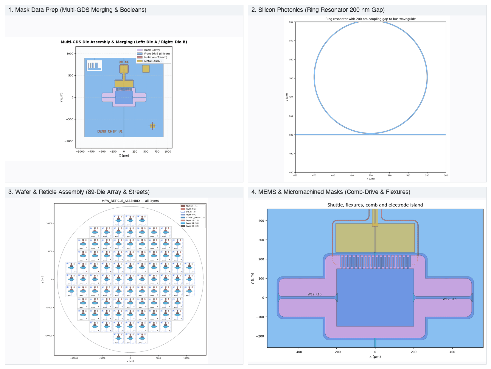
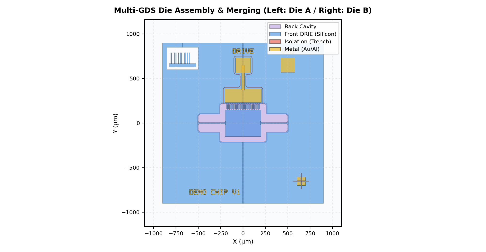
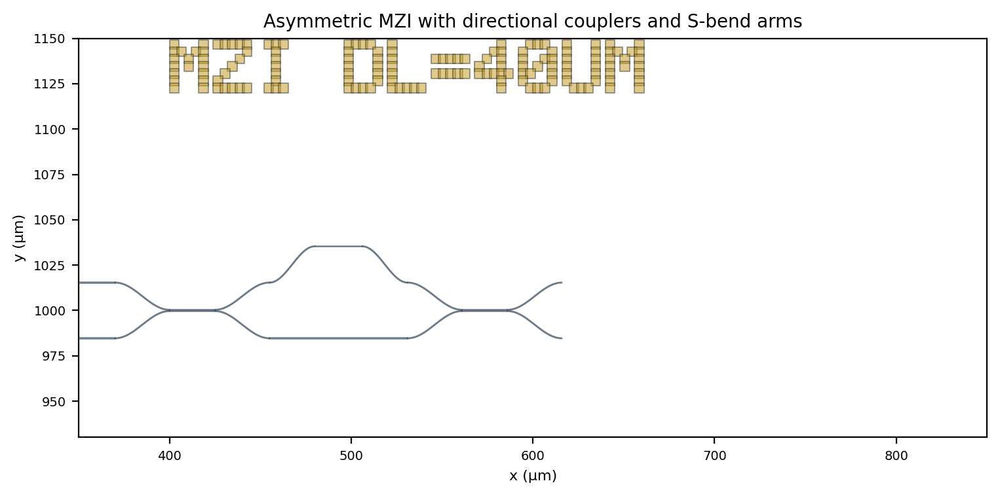
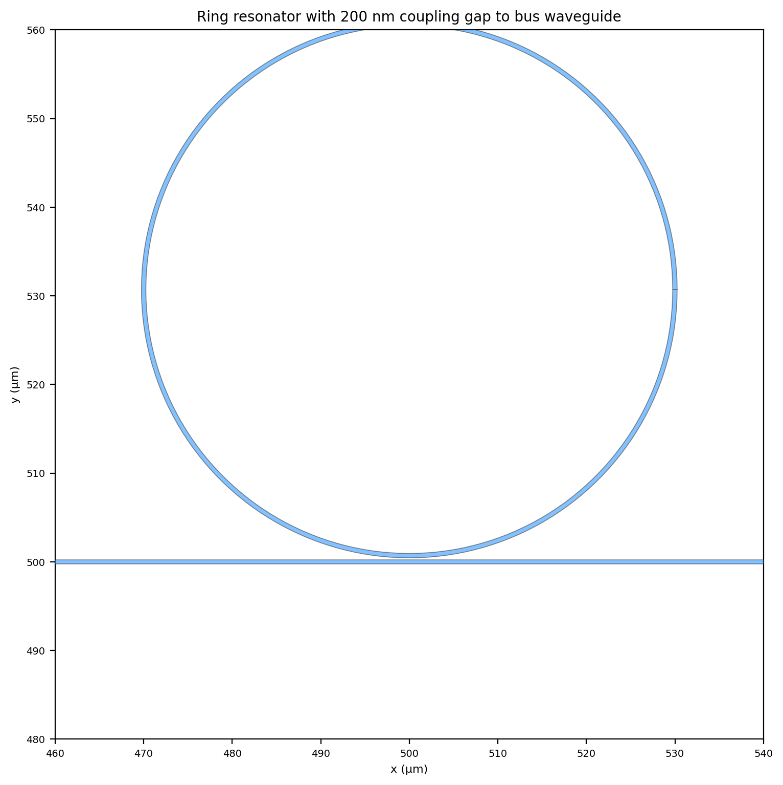
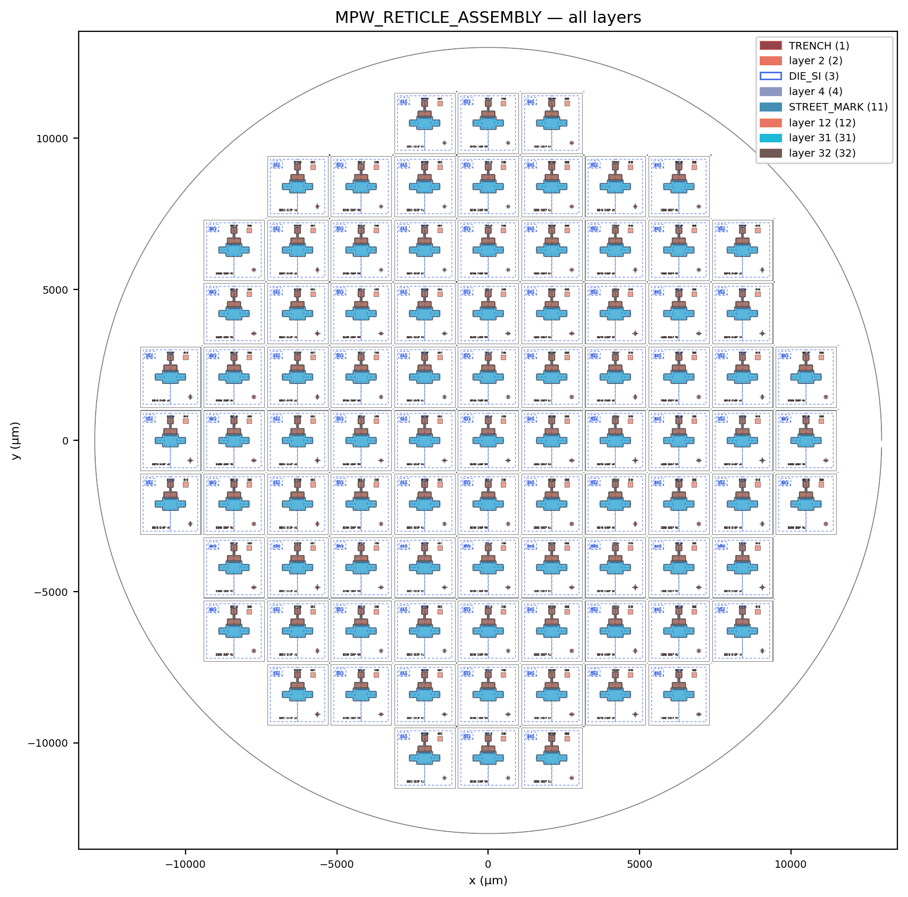
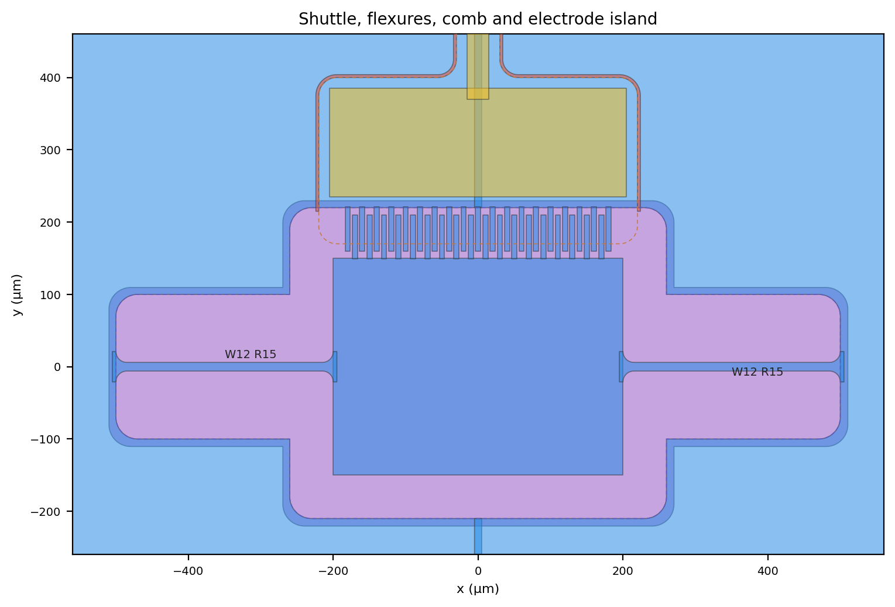
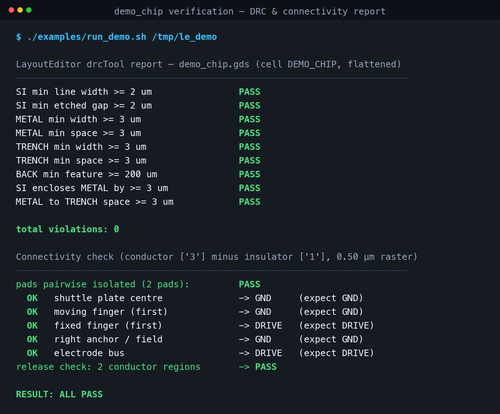

# LayoutEditor-skill

**English** | [简体中文](README.zh-CN.md)

An [Agent Skill](https://agentskills.io) for **headless mask-layout generation, preparation, wafer assembly, and verification with [juspertor LayoutEditor](https://layouteditor.com)** through its LayoutScript Python API. Your coding agent writes parametric generators, exports GDSII/OASIS/DXF, verifies designs (DRC, raster connectivity, mechanical release), tiles dies into wafers with dicing streets, and performs layer booleans and format conversions.

v0.2 covers four major domains (ordered by daily usage frequency):
1. **Layout data preparation and layer operations**: hierarchy inspection, format conversion (GDS ↔ DXF ↔ OASIS), layer remapping, collision-free multi-GDS merging, and batch layer booleans and sizing.
2. **Integrated Silicon Photonics (PIC)**: strip waveguides, cosine S-bends, continuous-curvature Euler bends, directional couplers, ring resonators, asymmetric MZI filters, and fiber grating couplers.
3. **Wafer and Reticle assembly**: multi-die placement on wafers (4/6/8-inch) or reticles, automated dicing streets, intersection cross alignment marks, and silicon area utilization reporting.
4. **MEMS and micromachined masks**: parametric comb actuators, flexure beams, isolation trench rings, plus headless DRC, netlist connectivity, and mechanical release verification.

- Agent-agnostic: follows the open [Agent Skills specification](https://agentskills.io/specification), compatible with Claude Code, Cursor, Codex, OpenCode, GitHub Copilot, Cline, and others.
- Installable via `npx skills`, or by cloning the repository.

> Not affiliated with juspertor GmbH. LayoutEditor is proprietary software; download and license it from the vendor. This skill automates it.

<p align="center">
  
</p>

---

## 1. Install the skill

### Option A — `npx skills`

Requires Node.js. Uses the open-source [skills CLI](https://github.com/vercel-labs/skills):

```bash
npx skills add laull9/LayoutEditor-skill
```

Installs into the current project; add `-g` for a global install:

```bash
npx skills add laull9/LayoutEditor-skill -g
```

Non-interactive install for specific agents:

```bash
npx skills add laull9/LayoutEditor-skill -g -a claude-code -a cursor -y
```

### Option B — manual clone

Clone the repository into your agent's skills directory, keeping the folder name `LayoutEditor-skill` (matching `name` in `SKILL.md`):

| Agent | User-level location | Project-level location |
|---|---|---|
| Claude Code | `~/.claude/skills/LayoutEditor-skill` | `<project>/.claude/skills/LayoutEditor-skill` |
| Shared-convention agents | `~/.agents/skills/LayoutEditor-skill` | `<project>/.agents/skills/LayoutEditor-skill` |
| Others | see your agent's documentation | |

```bash
git clone https://github.com/laull9/LayoutEditor-skill ~/.claude/skills/LayoutEditor-skill
```

## 2. Install LayoutEditor

Official website: <https://layouteditor.com>.

1. Open the official download page: **<https://layouteditor.com/download.html>**.
2. Select your operating system package:
   - macOS: `layout-<release>-macOS-universal.dmg`, drag `layout.app` to `/Applications`. If blocked by Gatekeeper: `xattr -d com.apple.quarantine /Applications/layout.app`.
   - Windows 64-bit: `layout-<release>-win-64bit-installer.msi` (or zip).
   - Linux: `layout-<release>-Linux.x86_64.AppImage`, or `.deb` / `.rpm`.
3. Licensing: the free edition runs scripts, DRC, and small-scale GDS exports. Paid editions remove element and boolean export gates.
4. Verify the bundled Python interpreter:

   ```bash
   scripts/find_layouteditor.sh
   ```

   Outputs e.g. `/Applications/layout.app/Contents/MacOS/Frameworks/Python.framework/Versions/3.14/bin/python3.14`.

## 3. Analysis and preview requirements

The verification and rendering scripts require a standard Python 3.8+ interpreter with numpy, Pillow, and matplotlib:

```bash
python3 -m pip install numpy pillow matplotlib
```

## 4. Examples and Quick Start

The repository includes runnable instances across all four domains:

### Instance 1: Layout data preparation and layer booleans

Performs layout inspection, GDS to DXF conversion, layer remapping, dual-die collision-free merging, and layer boolean difference and sizing:

```bash
examples/mask_prep/run_prep_demo.sh /tmp/le_prep
```

Outputs `converted.dxf`, `remapped.gds`, `dual_merged.gds`, and `boolean_result.gds`.

<p align="center">
  
</p>

Two dies merged into a single top cell with prefixed namespaces (`LEFT_` / `RIGHT_`) to eliminate cell name collisions.

### Instance 2: Silicon Photonics (PIC) test chip

Generates an integrated photonics test layout with an asymmetric MZI filter, all-pass ring resonator, Euler bend test loop, and fiber array grating couplers:

```bash
examples/photonic_circuit/run_pic_demo.sh /tmp/le_pic
```

Outputs `pic_chip.gds` and rendered zooms of the 200 nm coupling gap, MZI S-bends, and grating teeth.

<p align="center">
  
  
</p>

Left: MZI filter showing cosine S-bends and directional couplers. Right: all-pass ring resonator showing the 200 nm sub-micron coupling gap.

### Instance 3: Multi-die wafer and reticle assembly

Tiles dies into a 26 mm reticle field, draws 100 µm dicing streets and alignment crosses, and computes silicon area utilization:

```bash
examples/wafer_assembly/run_assembly.sh /tmp/le_wafer
```

Outputs `reticle_assembly.gds` and an assembly report (89 placed dies, 67.1% utilization).

<p align="center">
  
</p>

89 placed dies within the reticle field, complete with 100 µm dicing streets, intersection alignment crosses, and cell labels.

### Instance 4: 4-mask SOI-MEMS test chip (MEMS instance)

Runs micromachined chip generation, DRC, raster connectivity, and mechanical release verification:

```bash
examples/mems_comb_drive/run_mems.sh /tmp/le_demo
```

Or from the root compatibility wrapper: `examples/run_demo.sh /tmp/le_demo`.

<p align="center">
  
</p>

Shuttle, flexures, comb actuators, and electrode islands. Constructed with analytic geometry to avoid boolean engine export limits while retaining R15 fillets and micron-scale clearances.

<p align="center">
  
</p>

LayoutEditor drcTool reports 0 violations, and raster netlist/isolation checks report `ALL PASS`.

## 5. Direct CLI tool usage

```bash
LE_PY="$(scripts/find_layouteditor.sh)"

# 1. Inspect layout structure & element counts
"$LE_PY" scripts/layout_prep.py inspect my_chip.gds

# 2. Format conversion (GDS -> DXF / OASIS / CIF)
"$LE_PY" scripts/layout_prep.py convert my_chip.gds my_chip.dxf

# 3. Layer remapping
"$LE_PY" scripts/layout_prep.py remap my_chip.gds remapped.gds mapping.json

# 4. Multi-GDS merging with cell prefixes
"$LE_PY" scripts/layout_prep.py merge merge_spec.json merged.gds TOP_CELL

# 5. Wafer and reticle tiling
"$LE_PY" scripts/wafer_assembly.py wafer_cfg.json wafer.gds report.txt

# 6. Batch layer boolean & sizing
"$LE_PY" scripts/layer_boolean.py in.gds out.gds bool_ops.json TOP_CELL

# 7. Design-rule checking (DRC)
"$LE_PY" scripts/drc_check.py out.gds MY_TOP rules.json drc.txt

# 8. Raster connectivity & release verification
python3 scripts/check_connectivity.py out_polys.json probes.json nets.txt

# 9. Offline PNG previews and zoomed slices
python3 scripts/render_preview.py out_polys.json preview/ views.json
```

## 6. Repository structure

```
LayoutEditor-skill/
├── SKILL.md                          # Agent entry point (v0.2 workflows & rules)
├── scripts/
│   ├── le_helpers.py                 # Geometry helpers, LE session wrapper, boolean API hooks
│   ├── photonic_helpers.py           # PIC primitives (waveguides, S-bends, Euler bends, MZI, rings, gratings)
│   ├── layout_prep.py                # Inspection, format conversion, layer remapping, multi-GDS merging
│   ├── wafer_assembly.py             # Wafer/reticle multi-die tiling, dicing streets, cross marks
│   ├── layer_boolean.py              # Batch layer booleans (AND/OR/NOT/XOR) and sizing
│   ├── drc_check.py                  # JSON-driven LayoutEditor drcTool automation
│   ├── check_connectivity.py         # High-resolution raster netlist and release checker
│   ├── render_preview.py             # Headless PNG slice and overview renderer
│   └── find_layouteditor.sh          # Interpreter locator
├── examples/
│   ├── mask_prep/                    # Instance 1: Data prep, conversion, GDS merge & layer booleans
│   │   └── run_prep_demo.sh
│   ├── photonic_circuit/             # Instance 2: Silicon Photonics test chip (MZI, ring, Euler bend)
│   │   ├── pic_chip.py
│   │   ├── pic_views.json
│   │   └── run_pic_demo.sh
│   ├── wafer_assembly/               # Instance 3: Multi-die reticle assembly and dicing streets
│   │   ├── wafer_config.json
│   │   └── run_assembly.sh
│   ├── mems_comb_drive/              # Instance 4: 4-mask SOI-MEMS comb-drive test chip
│   │   ├── demo_chip.py
│   │   ├── demo_drc_rules.json
│   │   ├── demo_probes.json
│   │   ├── demo_views.json
│   │   └── run_mems.sh
│   ├── demo_chip.py                  # Preserved root-level backward-compatible entry
│   └── run_demo.sh                   # Preserved root-level backward-compatible runner
└── references/                       # Technical references
    ├── data-prep-and-assembly.md     # Inspection, multi-GDS merging, and wafer tiling
    ├── boolean-workflow.md           # Programmatic layer logic and sizing
    ├── photonic-layout.md            # Waveguide mathematics, Euler curves, and PIC devices
    ├── geometry-techniques.md        # Boolean-free fillets, rings, and keyhole loops
    ├── mems-soi-process.md           # 4-mask SOI-MEMS design rules and polarities
    ├── verification.md               # Multi-stage verification checklist
    ├── layoutscript-api.md           # Measured API quirks and signatures
    ├── free-version-limits.md        # Free license export gate measurements and workarounds
    └── troubleshooting.md            # Common issues and solutions
```

## 7. Key facts

- 1 database unit = 1 nm. Helpers take µm.
- `strans.rotate()` is clockwise; `LE.ref(..., ang)` handles CCW degrees.
- Free license export gate: GDS export is refused if the boolean engine has been used or if element count exceeds ~8k–10k. Analytical geometry should be used for free-license mask exports; boolean operations are supported for intermediate analysis or licensed environments.
- 1-D arrays only: `addCellrefArray` is reliable only with `ny = 1`.
- Headless screenshots: native screenshots come out blank; preview generation uses the exported JSON polygon dataset.

## License

[MIT](LICENSE) © 2026 laull9
