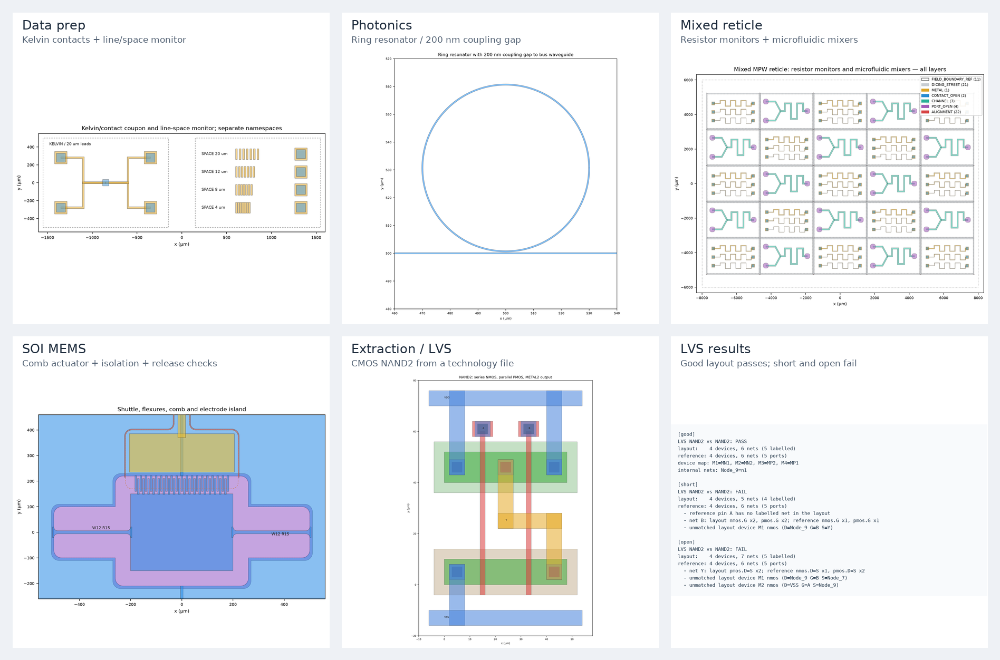
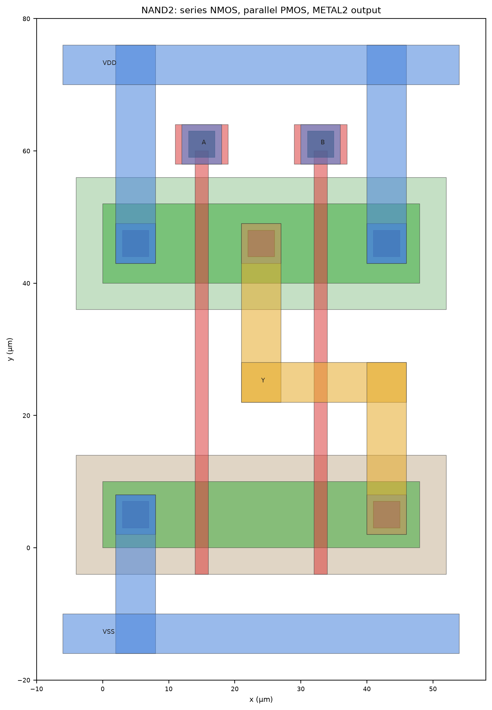
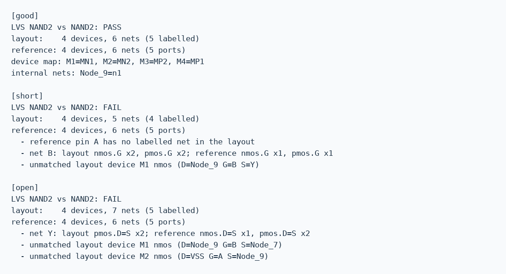

# LayoutEditor-skill

[English](README.md) | 简体中文

一个 agent skill，让 Codex, Claude Code 等编程 agent 通过 [juspertor LayoutEditor](https://layouteditor.com)
完成版图工作。你用自然语言描述掩模、芯片或文件问题，agent 调用 LayoutEditor 的 Python 接口去做，
检查自己的产出，最后告诉你哪些检查通过、哪些还没验证。



## 装上之后，agent 能做什么

**处理已有版图。** 找出 GDS 的 top cell、单位和全部 layer/datatype 组合；对照你的工艺审计文件：
未声明的层、错误的数据库单位、离开制造网格的顶点；只改 pin 或 fill 的 datatype 而不动绘图数据；
把 10 nm 单位的文件换成 1 nm 且尺寸不变；转 OASIS、DXF；合并 cell 名冲突的多个文件。

**工艺描述一次，之后按层名画图。** agent 根据 foundry 的 layer map 和设计手册写一个小型 JSON
技术文件：层表、单位、金属/via 堆叠、器件识别层，以及你关心的设计规则。生成脚本用
`"METAL1.PIN"` 而不是 `8/2`，审计、DRC 和提取读同一份文件。

**用原生引擎检查电路。** LayoutEditor 自己的引擎从版图中提取晶体管、电阻和网络；skill 把结果与
你的 SPICE 网表比较，不一致时指出是哪里短路、开路或接错了器件。

**参数化生成掩模。** 带圆角、隔离槽和释放检查的 SOI MEMS 执行器；光子 MZI、微环、光栅、
Euler 弯曲；测试结构；多种 die 混排的 reticle 和圆形 wafer 排布。

**留下可复查的证据。** 每个 runner 都输出 GDS、DRC 报告、验证结果和 PNG 预览，方便你逐项查看。

## 可以这样对 agent 说

- “检查 `chip.gds` 用了哪些 layer/datatype，是不是都在 5 nm 网格上。”
- “这个文件是 10 nm 单位，给我一份 1 nm 的副本，并证明几何没动。”
- “外发前把所有 `*.pin` datatype 改成 2，去掉 fill 的 datatype。”
- “这是我们的 layer map 和规则表，做一个技术文件，再用它检查我的版图。”
- “在这个工艺里画一个两输入 NAND，跑 DRC，提取后对 `nand2.sp` 做 LVS。”
- “把这三个测试芯片排到 16×12 mm 的 reticle 上，划片道 100 µm。”
- “做一个 3 µm 间隙的参数化梳齿驱动，检查焊盘互相隔离、释放后没有悬空结构。”

## 它怎么工作

请求涉及版图时，agent 读取 [SKILL.md](SKILL.md)。这份文件把任务分派到对应的参考文档和脚本，
并写明报告成功前必须通过的检查。之后 agent 会：

1. 找到 LayoutEditor 自带的 Python（含 `LayoutScript` 模块）；
2. 先检查已有输入（单位、top、层对），凡是影响制造结果的信息（规则、层号、器件层）都向你确认；
3. 在 LayoutEditor 的解释器里运行生成、数据准备、DRC 和原生提取，每个进程只开一个版图会话；
4. 在普通 Python 里做预览、栅格检查和 LVS 比较；
5. 汇报写出的文件、执行过的检查及结果，以及没有验证的部分。

这些脚本也可以手动运行，每个文件开头都写了命令行用法。

## 环境与安装

- **LayoutEditor**：从[官方下载页](https://layouteditor.com/download.html)安装。macOS 把 `layout.app`
  放在 `/Applications`。免费版可以运行全部自带示例；布尔运算导出和较大的版图取决于授权。
  本项目与 juspertor GmbH 无关，也不分发 LayoutEditor。
- **Python 3.8+**，安装 `numpy pillow matplotlib`，用于预览和分析。

```bash
npx skills add laull9/LayoutEditor-skill        # 加 -g 为全局安装
```

也可以克隆到 agent 的 skill 目录，目录名用 `layout-skill`：

```bash
git clone https://github.com/laull9/LayoutEditor-skill ~/.claude/skills/layout-skill
```

确认能找到解释器，并安装分析依赖：

```bash
~/.claude/skills/layout-skill/scripts/find_layouteditor.sh
python3 -m pip install numpy pillow matplotlib
```

可以用 `LE_PY` 和 `PYTHON` 覆盖两个解释器。macOS 已实测，Linux 和 Windows 仍需本地验证。

## 自带示例

每个 runner 接收一个输出目录，自行生成输入，任何检查失败都会停止。

| 示例 | 运行 | 展示内容 |
|---|---|---|
| CMOS LVS | `examples/cmos_lvs/run_lvs_demo.sh /tmp/le_lvs` | 技术文件 → 按层名画 NAND2 → 审计 → 7 条 DRC → 原生提取 → LVS。正确版图通过；A–B 短路和缺 via 两个变体失败，并给出原因 |
| 数据准备 | `examples/mask_prep/run_prep_demo.sh /tmp/le_prep` | 两份 TOP/PAD 同名的测试结构；OASIS/DXF 转换、图层映射、加命名空间合并 |
| 光子 | `examples/photonic_circuit/run_pic_demo.sh /tmp/le_pic` | 连通的 MZI（ΔL = 40 µm）、200 nm 间隙微环、浅刻蚀光栅、Euler 弯曲；3 条 DRC |
| 混排 reticle | `examples/wafer_assembly/run_assembly.sh /tmp/le_assembly` | 16×12 mm 视场内 25 个电阻与微流控 die，含划片道和对准标记 |
| SOI MEMS | `examples/mems_comb_drive/run_mems.sh /tmp/le_mems` | 带圆角、隔离槽和背腔的梳齿执行器；9 条 DRC、焊盘隔离与释放检查 |



三个 NAND2 变体的 LVS 输出：



示例中的尺寸和规则都是示意值，用来演示方法，不代表经过验证的工艺。

## 边界

- LVS 比较电路拓扑：器件、端口和网络。不比较器件尺寸（W/L、阻值）、寄生参数和 foundry deck 规则。
- JSON DRC runner 支持六种规则。密度、天线、填充等 foundry 检查需要 foundry 的 deck。
- LayoutEditor 的加密 PDK 包、PCell、原理图驱动布局和 OpenAccess 库在 GUI 中使用，不在这些
  无界面脚本里。可以在 GUI 中导出 GDS，再回到这里继续。
- LayoutEditor 按层号做检查和提取。同一层号的不同 datatype 会一起检查，除非技术文件把它们排除在连接之外。
- 免费版的布尔/尺寸运算可能阻止导出；skill 不会绕过授权限制。

实测的原生行为和尚存缺口见[需求覆盖评估](docs/coverage-assessment.zh-CN.md)和 [TODO](TODO.md)。

## 仓库结构

| 路径 | 内容 |
|---|---|
| [SKILL.md](SKILL.md) | agent 读取的内容：任务分派、约束、流程 |
| [references/](references/) | [数据准备](references/data-prep-and-assembly.md)、[PDK 工作流](references/pdk-workflow.md)、[提取与 LVS](references/extraction-lvs.md)、[验证](references/verification.md)、[光子](references/photonic-layout.md)、[SOI MEMS](references/mems-soi-process.md)、[几何](references/geometry-techniques.md)、[布尔运算](references/boolean-workflow.md)、[授权限制](references/free-version-limits.md)、[API 笔记](references/layoutscript-api.md)、[故障排查](references/troubleshooting.md)（英文） |
| `scripts/` | `layout_prep.py`、`tech.py`、`pdk_tool.py`、`extract_netlist.py`、`lvs_compare.py`、`drc_check.py`、`check_connectivity.py`、`render_preview.py`、`wafer_assembly.py`、`le_helpers.py`、`photonic_helpers.py`、`layer_boolean.py`、`dump_layout.py` |
| `examples/` | 上面五个 runner |
| `tests/`、[docs/example-validation.md](docs/example-validation.md) | gdstk 独立检查与原生契约测试 |

维护者用下面的命令重建全部示例，运行 7 项输出检查和 9 项原生契约测试，并刷新图片与 `assets/manifest.json`：

```bash
python3 -m pip install numpy pillow matplotlib gdstk
python3 scripts/update_assets.py /tmp/layout-skill-examples
```

## 许可

[MIT](LICENSE)，2026 laull9。
